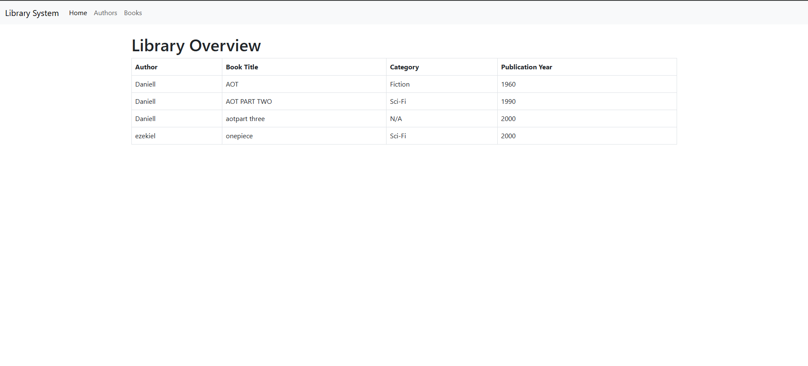
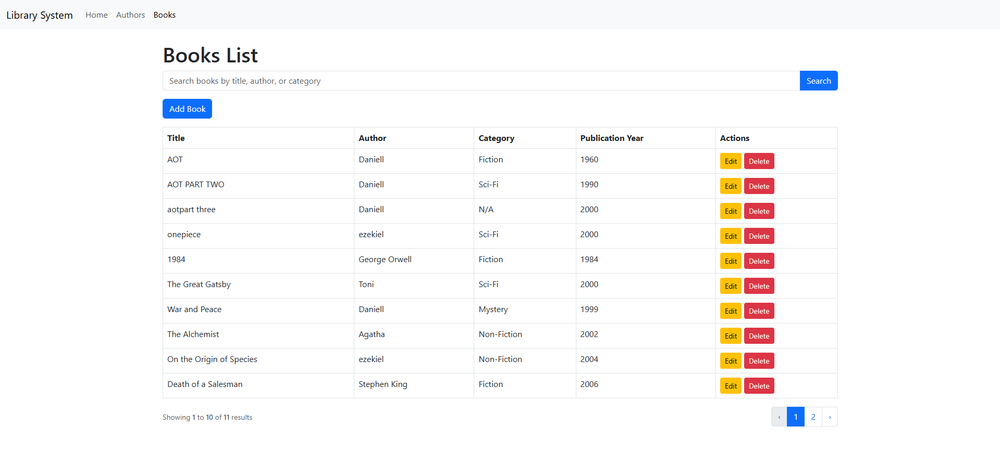
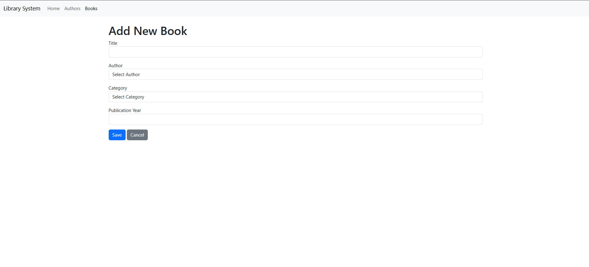
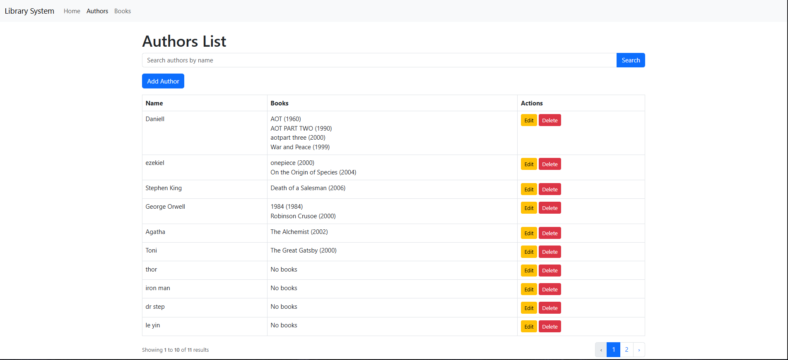

# Library System (Midterm Project)

A **Library Transaction Processing System (TPS)** built using **Laravel PHP Framework** to manage authors and books with a clean, responsive, and user-friendly interface.

---

## Description / Overview

This is a **web-based Library Management System** designed to perform **CRUD operations** on **Authors** and **Books**. The system features a **Home page** that displays all authors and their published books, including titles, categories, and publication years. It uses **two related database tables** (`authors` and `books`) with a **one-to-many relationship** (one author can have many books). Categories are stored directly in the `books` table as strings (e.g., Fiction, Sci-Fi), keeping the design simple and aligned with best practices for small-scale systems.

The project is inspired by the **PHPZAG Library Tutorial** but enhanced with a **custom Home page**, **search functionality**, **pagination**, and **Bootstrap 5** for modern UI.

---

## Objectives

- Implement **MVC architecture** using Laravel.
- Use **two related database tables** with proper fields and relationships.
- Demonstrate **CRUD operations** for Authors and Books.
- Implement **search and pagination** for better usability.
- Create a **centralized Home page** showing all authors and their books.
- Use **Blade templating**, **Eloquent ORM**, and **Bootstrap 5** for responsive design.
- Follow clean coding standards and Laravel conventions.

---

## Features / Functionality

| Feature | Description |
|--------|-----------|
| **Home Page** | Displays all authors and their books in a single table (title, category, year). |
| **Authors CRUD** | Add, edit, delete, and view authors. |
| **Books CRUD** | Add, edit, delete, and view books with author and category selection. |
| **Search** | Search books by **title**, **author name**, or **category**. |
| **Pagination** | Books list shows 10 items per page with navigation links. |
| **Category Dropdown** | Predefined categories: Fiction, Non-Fiction, Sci-Fi, Mystery, Biography. |
| **Responsive Design** | Mobile-friendly UI using Bootstrap 5. |
| **Validation** | Form inputs are validated (e.g., required fields, year format). |

---

## Installation Instructions

### Prerequisites
- PHP >= 8.1
- Composer
- MySQL
- Node.js & NPM (optional for asset compilation)
- Git

### Steps

1. **Clone the repository**
   ```bash
   git clone https://github.com/YOUR_USERNAME/YOUR_REPO_NAME.git
   cd YOUR_REPO_NAME
2. **Install dependencies**
    composer install
3. **Copy .env file**
    cp .env.example .env
4. **Generate app key**
    php artisan key:generate
5. **Configure database in .env**
DB_CONNECTION=mysql
DB_HOST=127.0.0.1
DB_PORT=3306
DB_DATABASE=library_system
DB_USERNAME=root
DB_PASSWORD=
6. **Run migrations**
    php artisan migrate
7. **(Optional) Seed sample data**
    php artisan db:seed
8. **Start the server**
    php artisan serve
9. **Open in browser**
    http://127.0.0.1:8000

--

## Usage
**Home Page (/)**
View all authors and their books at a glance.
**Authors Section (/authors)**

- Click "Add Author" to create a new author.
- Click "Edit" or "Delete" to modify or remove.


**Books Section (/books)**

- Use the search bar to filter by title, author, or category.
- Click "Add Book" to create a new book (select author and category).
- Use pagination to navigate through multiple pages.

## Screenshots

### Home Page (Library Overview)


### Books List with Search & Pagination


### Add New Book Form


### Authors Management



## Code Snippets

### Book Model – Relationship
```php
// app/Models/Book.php
protected $fillable = ['title', 'author_id', 'category', 'publication_year'];

public function author()
{
    return $this->belongsTo(Author::class);
}


```markdown
### Search & Pagination in Controller
```php
// app/Http/Controllers/BookController.php
$books = Book::with('author')
    ->when($search, function ($query, $search) {
        return $query->where('title', 'like', "%{$search}%")
                     ->orWhere('category', 'like', "%{$search}%")
                     ->orWhereHas('author', fn($q) => $q->where('name', 'like', "%{$search}%"));
    })
    ->paginate(10);


```markdown
### Pagination Links in Blade
```blade
{{ $books->appends(['search' => $search])->links() }}


## Contributors
 - Full Name – DANIEL EZEKIEL M. DUCUSIN
 - Student ID: 221-0145-2 | Section: 4-B

